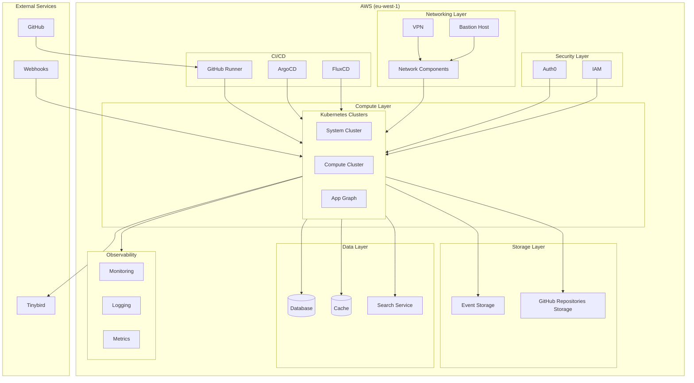

# WeR1 Infrastructure as Code Documentation

## Overview
The WeR1 infrastructure is a production-grade, multi-component system deployed on AWS in the eu-west-1 region. The infrastructure follows a microservices architecture with GitOps practices, using Kubernetes for orchestration and multiple specialized services for different aspects of the application.

## Architecture Diagram

## Repository Structure
Each component is maintained in its own GitHub repository for better isolation and management:

### Core Infrastructure
1. **Networking (`aws-eu-west-1-prod-networking-main`)**
   - Purpose: Manages VPC, subnets, routing, and network security
   - Key components: VPC, NAT Gateways, Security Groups, NACLs

2. **VPN (`aws-eu-west-1-prod-vpn-main`)**
   - Purpose: Secure remote access to the infrastructure
   - Components: VPN Gateway, Client VPN Endpoints

3. **Bastion (`aws-eu-west-1-prod-bastion-main`)**
   - Purpose: Secure jump host for infrastructure access
   - Components: EC2 instance, security configurations

### Compute Infrastructure
1. **Kubernetes System Cluster (`aws-eu-west-1-prod-cluster-system-main`)**
   - Purpose: Hosts system-level services and controllers
   - Components: EKS configuration, system namespaces

2. **Kubernetes Compute Cluster (`aws-eu-west-1-prod-cluster-compute-main`)**
   - Purpose: Hosts application workloads
   - Components: EKS configuration, application namespaces

3. **Application Graph (`aws-eu-west-1-prod-app-graph-main`)**
   - Purpose: Application dependency and routing management
   - Components: Service mesh, routing rules

### Data Layer
1. **Database (`aws-eu-west-1-dev-database-main`)**
   - Purpose: Main data storage
   - Components: RDS/Aurora configuration

2. **Cache (`aws-eu-west-1-prod-cache-main`)**
   - Purpose: Application caching layer
   - Components: ElastiCache configuration

3. **Search (`aws-eu-west-1-prod-search-main`)**
   - Purpose: Search functionality
   - Components: Elasticsearch/OpenSearch configuration

### Storage
1. **Event Storage (`aws-eu-west-1-prod-storage-event-storage-main`)**
   - Purpose: Event data persistence
   - Components: S3 buckets, lifecycle policies

2. **GitHub Storage (`aws-eu-west-1-prod-storage-github-repositories-main`)**
   - Purpose: GitHub artifacts storage
   - Components: S3 buckets, access policies

### Security
1. **IAM (`aws-eu-west-1-prod-iam-main`)**
   - Purpose: Identity and access management
   - Components: IAM roles, policies, users

2. **Auth0 (`aws-eu-west-1-prod-auth-zero-main`)**
   - Purpose: Authentication and authorization
   - Components: Auth0 configuration, integration

### CI/CD
1. **GitHub Repositories (`aws-eu-west-1-prod-github-repositories-main`)**
   - Purpose: Source code management
   - Components: Repository configurations

2. **GitHub Runner (`aws-eu-west-1-prod-github-runner-main`)**
   - Purpose: CI/CD execution
   - Components: Self-hosted runners configuration

3. **ArgoCD (`argocd-main`)**
   - Purpose: GitOps deployment for Kubernetes
   - Components: ArgoCD installation, application definitions

4. **FluxCD (`fluxcd-prod-main`)**
   - Purpose: Alternative/complementary GitOps tool
   - Components: FluxCD configuration

### Monitoring
1. **Observability (`aws-eu-west-1-prod-observability-main`)**
   - Purpose: Monitoring and logging
   - Components: Prometheus, Grafana, logging stack

### External Services
1. **Tinybird (`tinybird-main`)**
   - Purpose: Real-time analytics
   - Components: Tinybird integration configuration

2. **Webhooks (`webhooks-main`)**
   - Purpose: External service integration
   - Components: Webhook handlers and processors

3. **Media Processing (`media-processing-server-main`)**
   - Purpose: Media file handling
   - Components: Media processing configuration

### Governance
1. **Governance (`aws-eu-west-1-prod-governance-main`)**
   - Purpose: Policy and compliance management
   - Components: Policy definitions, compliance checks

2. **Budgeting (`aws-eu-west-1-root-budgeting-main`)**
   - Purpose: Cost management
   - Components: Budget configurations, cost alerts

## Key Patterns and Practices
1. **GitOps**
   - All infrastructure changes are version controlled
   - ArgoCD and FluxCD for automated deployments
   - Self-hosted runners for CI/CD

2. **Security**
   - Multi-layer security approach
   - VPN and bastion for secure access
   - Auth0 for authentication
   - IAM for fine-grained permissions

3. **Scalability**
   - Kubernetes-based orchestration
   - Separate compute and system clusters
   - Caching layer for performance

4. **Observability**
   - Comprehensive monitoring setup
   - Centralized logging
   - Real-time analytics with Tinybird

5. **Data Management**
   - Separate storage for different purposes
   - Event-driven architecture support
   - Search capabilities

## Infrastructure Flow
1. Changes are committed to respective GitHub repositories
2. GitHub runners execute CI/CD pipelines
3. ArgoCD/FluxCD detect changes and apply to clusters
4. Applications run in compute cluster
5. System services run in system cluster
6. Data flows through cache and database layers
7. Events are stored in event storage
8. Monitoring provides visibility across all components 